# Figove gulky v cokolade #

## Suroviny ##
- Vlasske orechy
- Figy (susene)
- Piskoty
- Pomarac
- Praskovy cukor
- Vanilkovy cukor
- Margarin
- Cokolada na varenie

## Postup ##
1. Orechy pomelieme. 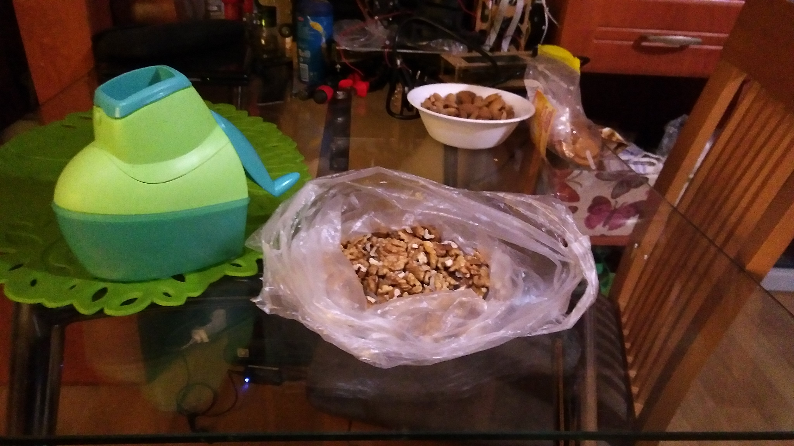 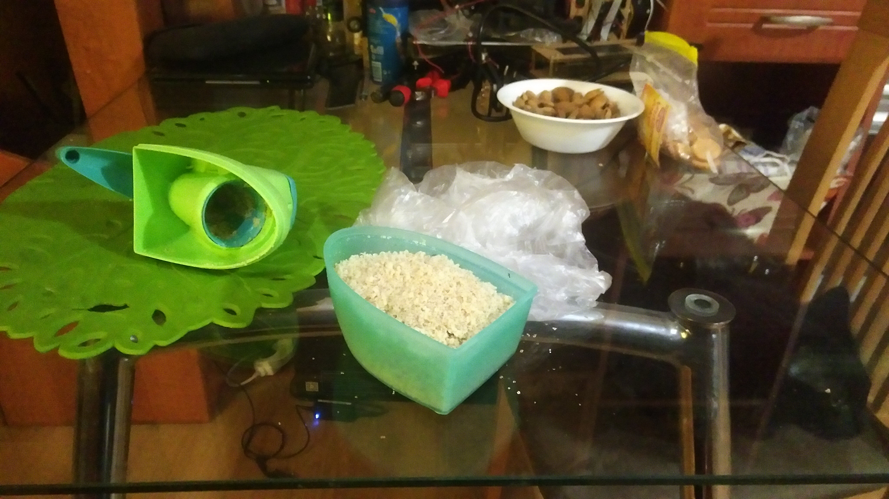
2. Ukazeme kocurovi, ze to nie je nic pre neho. 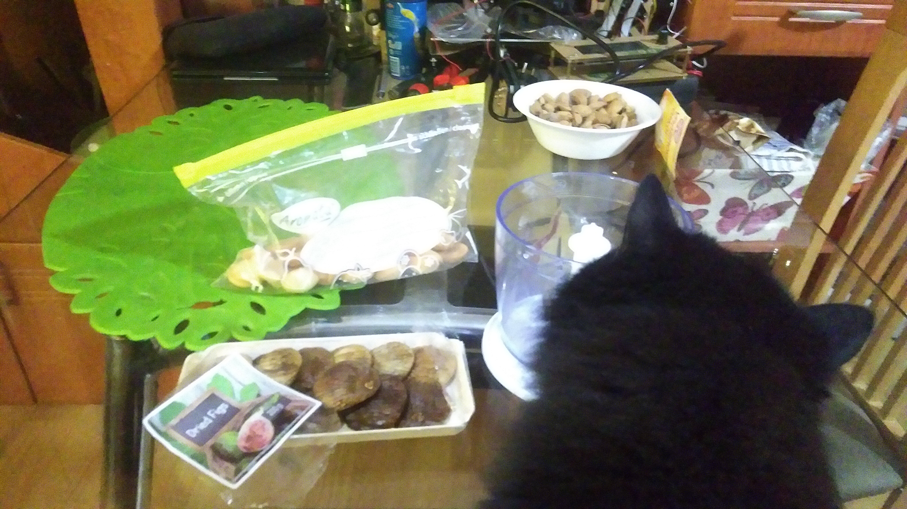
3. Figy odstopkujeme a spolu s piskotami pomelieme. 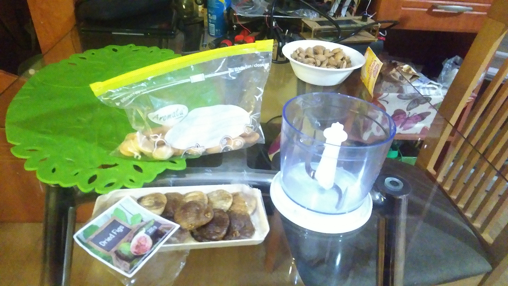 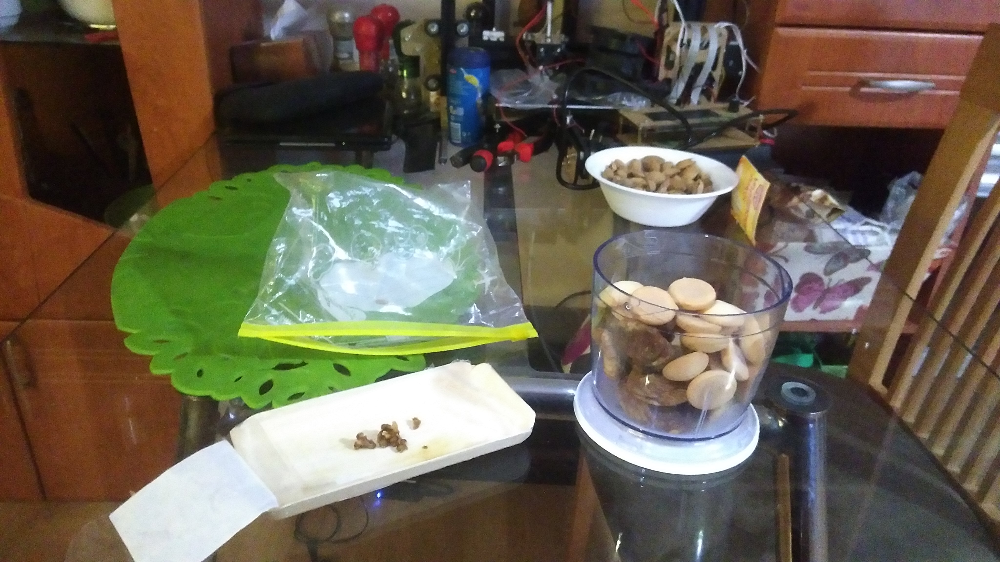 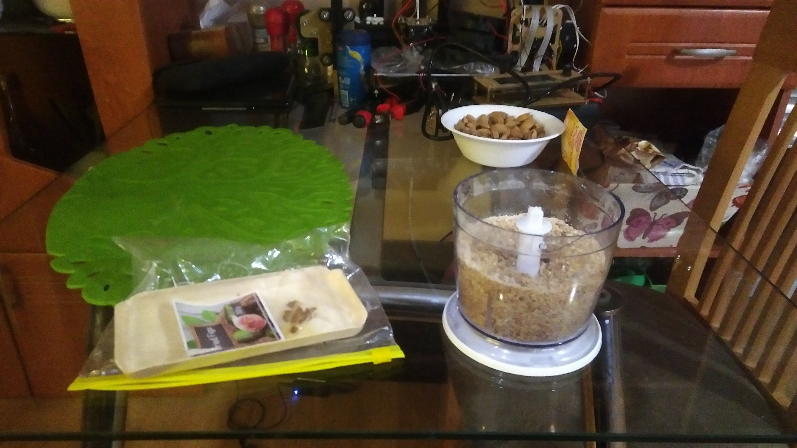
4. Odstavime pomaranc a stavu zmiesame s pomletymi orechmi, figami a piskotami a praskovym a vanilkovym cukrom. Vyslednu zmes dobre vymiesime, aby sa z nej dali robit gulocky. 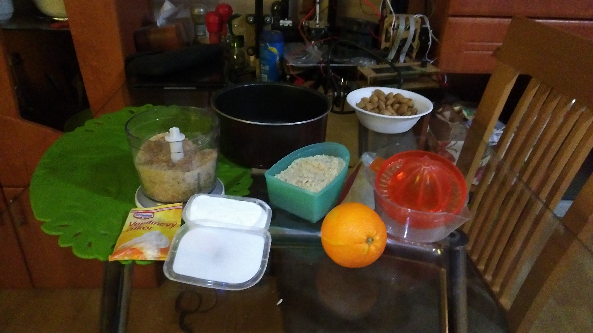 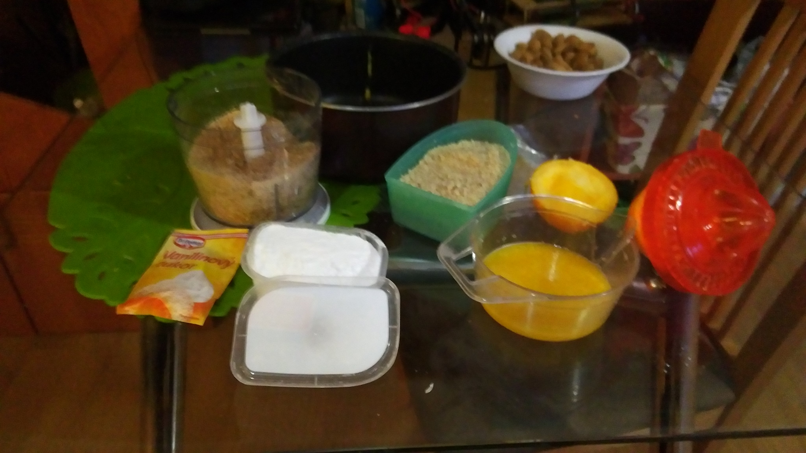 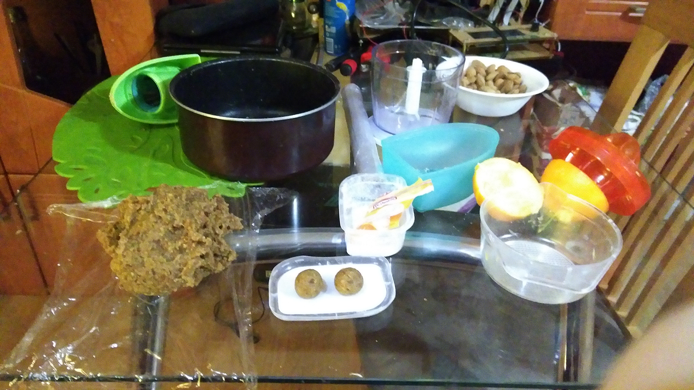
5. Zo zmesi narobime gulocky. Zmes som nechal cez noc v chladnicke ulezat, gulocky ukladam na papier na pecenie. Piect nebudeme, len aby sa nelepili. 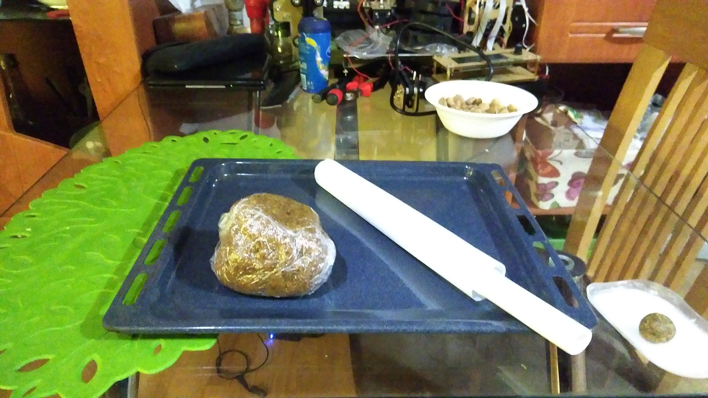 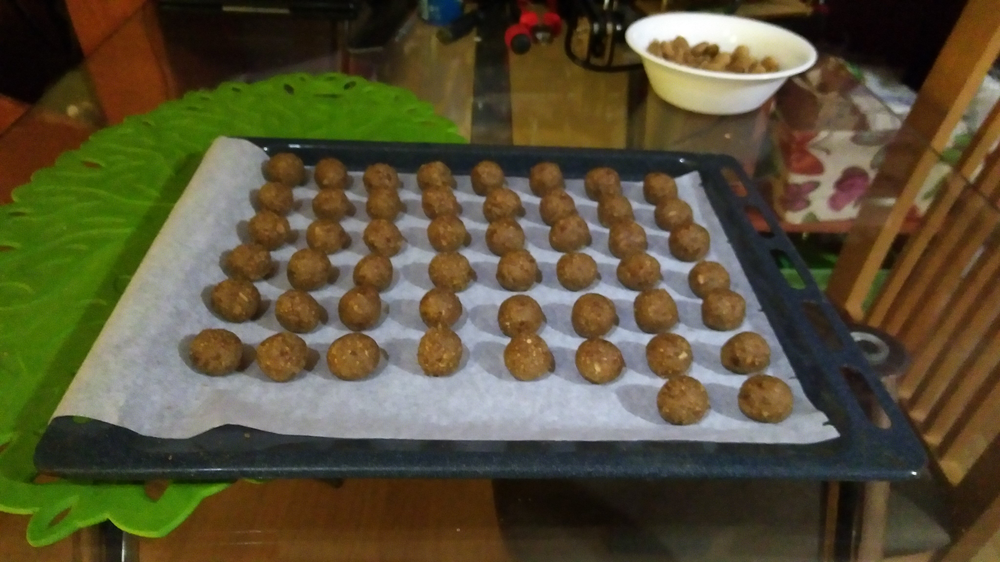
6. Rozopime margarin a horku okoladu vo vodnom kupeli. 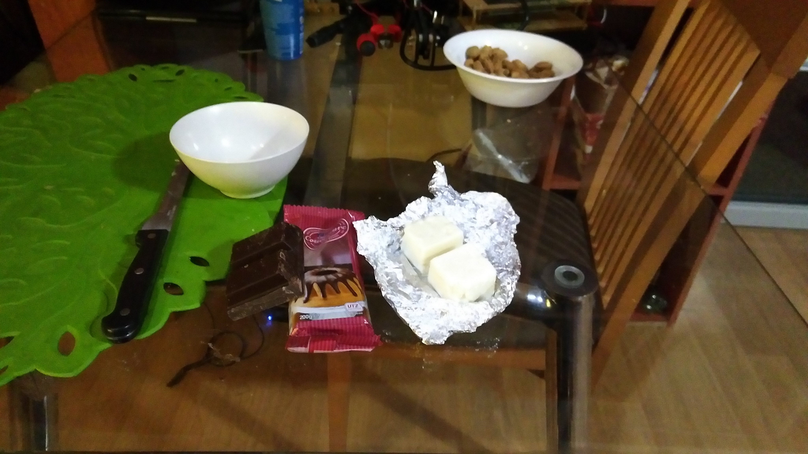 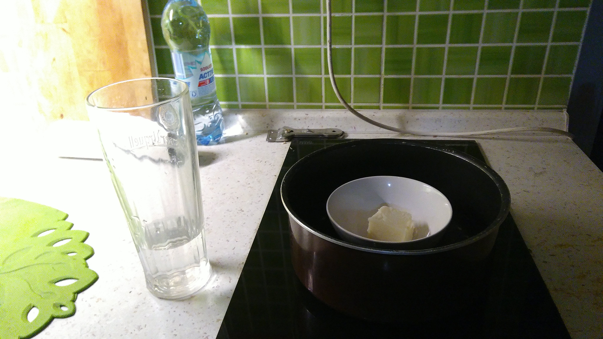 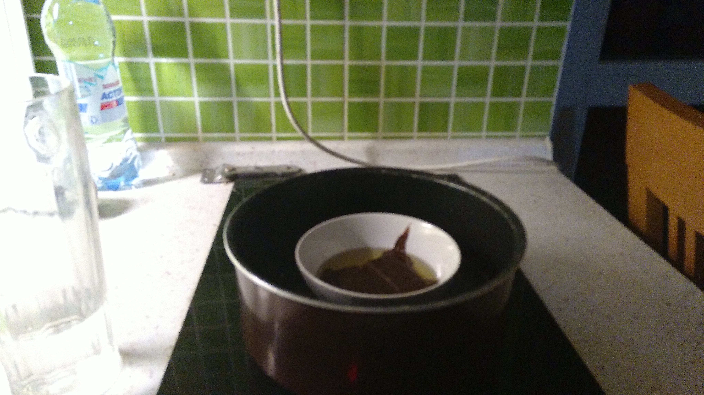
7. Gulkocky macame v zmesi rozpustenej cokolady a margarinu. Nakoniec ich mozeme pokvapkat cokoladou aby sme vytvorili prskavy vzor. 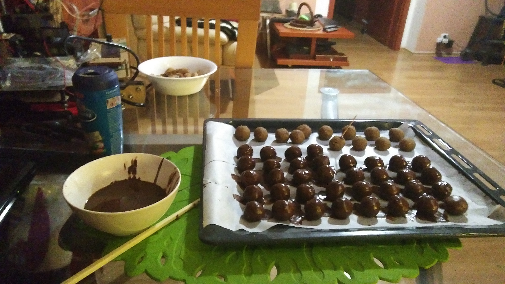 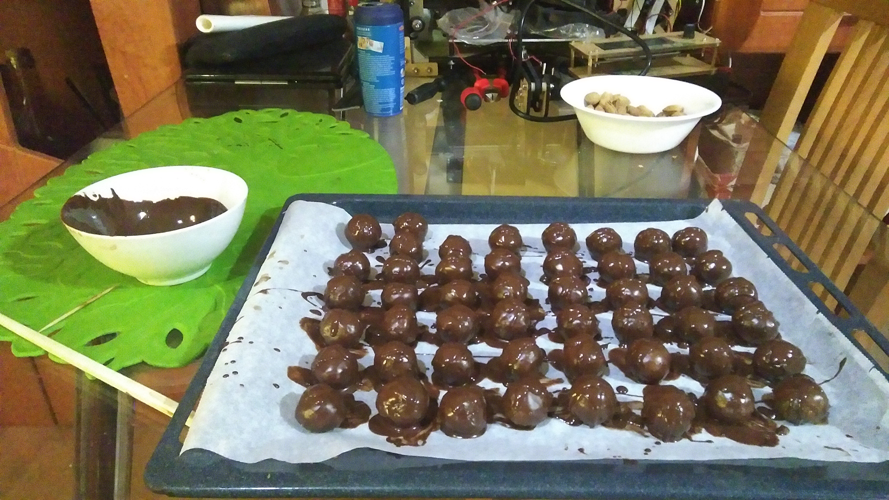
8. Vychutname s vysledky nasej prace. 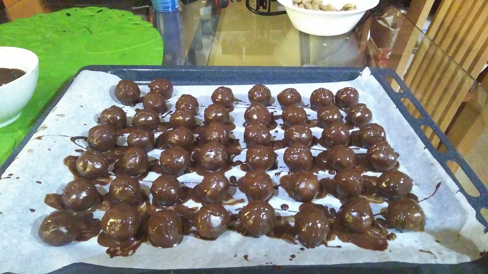
