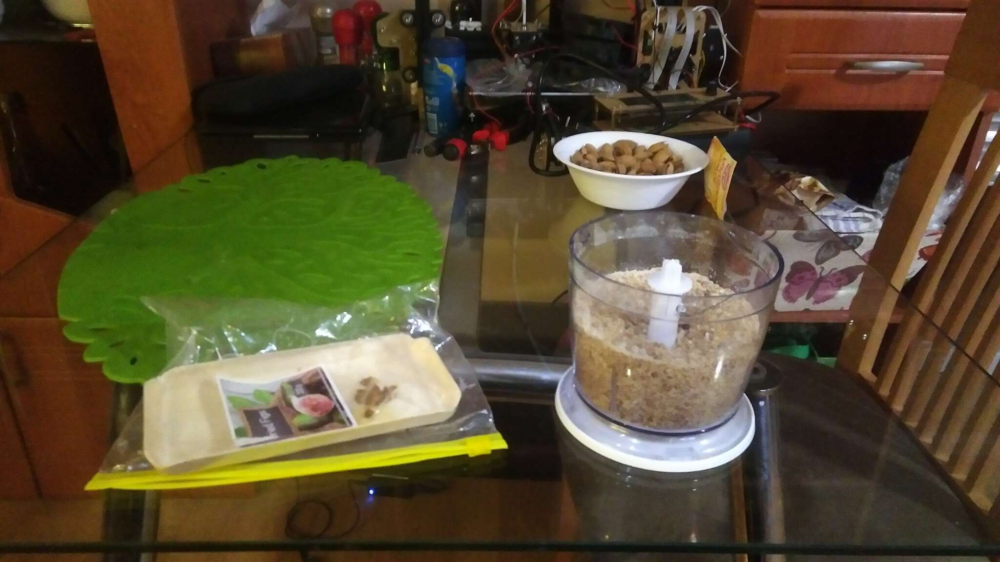
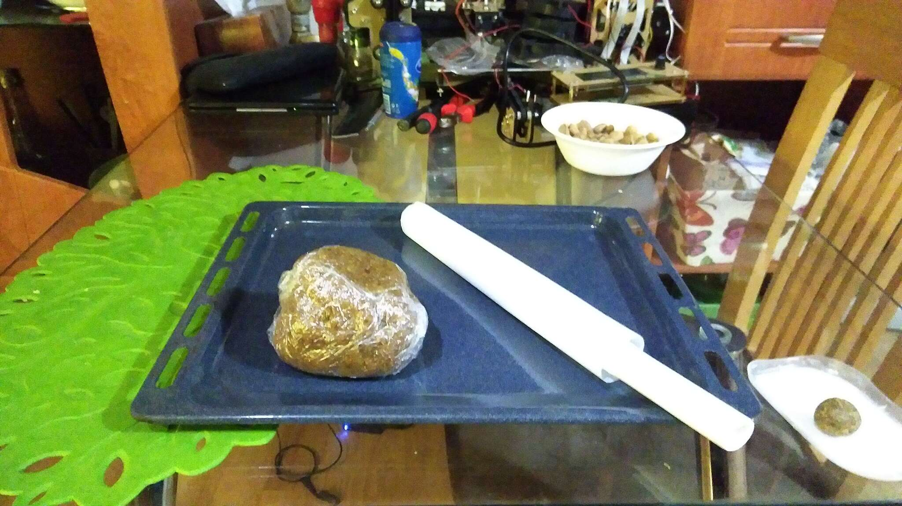
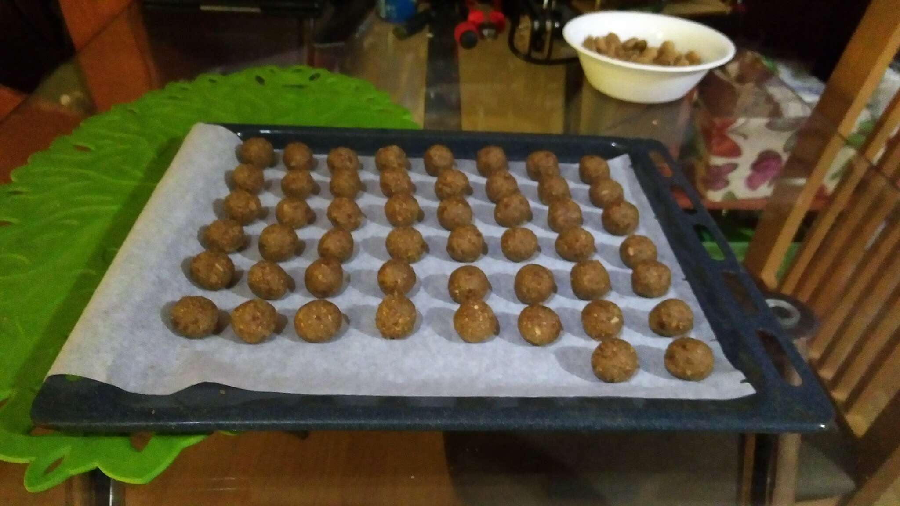
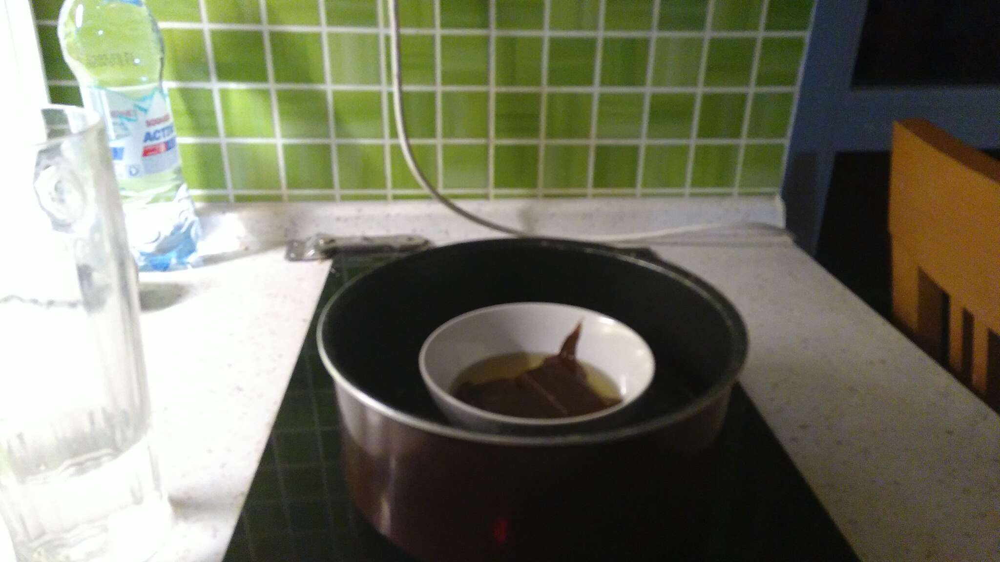
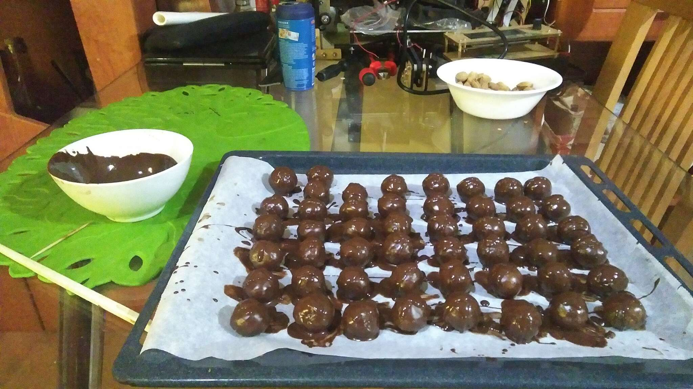
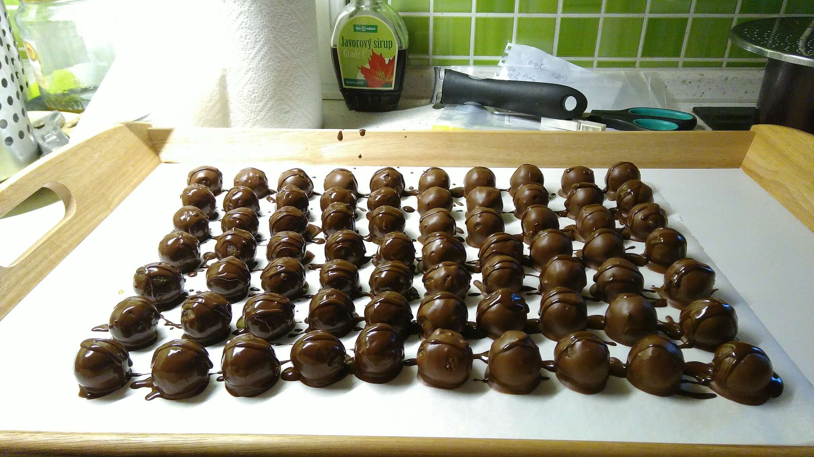

# Figové guľky v čokoláde #

## Suroviny ##
- Figy (sušené) - 250g
- Vlašské orechy - 150g (ak sa nebudú pridávať piškóty, tak 250g)
- Piškóty - 100g (môže byť aj 50g)
- Pomaranč - 1 veľký, alebo 2 menšie
- Práškový cukor - 100g
- Vanilkový (vanilínový) cukor - 1 balenie (20g)
- Margarín
- Čokoláda na varenie

## Opis postupu ##
Figy, orechy a piškóty pomelieme, pomaranč odšťavíme a všetky ingrediencie (okrem margarínu a čokolády na varenie, tie sú na polevu) zmiešame na hustú lepkavú hmotu. Vlhkými rukami tvarujeme guľôčky a tie namáčame do polevy z čokolády a margarínu.

## Názorný postup ##
1. Orechy pomelieme.  
2. Ukážeme kocúrovi, že to nie je nič pre neho. 
3. Figy odstopkujeme a spolu s piškótami pomelieme.   
4. Odšťavíme pomaranč a šťavu zmiešame s pomletými orechmi, figami a piškótami a práškovým a vanilkovým cukrom. Výslednú zmes dobre vymiesime, aby sa z nej dali robiť guľôčky.   
5. Zo zmesi narobíme guľôčky. Zmes sme nechali cez noc v chladničke uležať, guľôčky ukladáme na papier na pečenie. Piecť nebudeme, len aby sa nelepili.  
6. Roztopíme margarín a horkú čokoládu vo vodnom kúpeli.   
7. Guľôčky máčame v zmesi rozpustenej čokolády a margarínu. Nakoniec ich môžeme pokvapkať čokoládou aby sme vytvorili prskaný vzor.  

## Vysledky ##
2019
2020
2021
