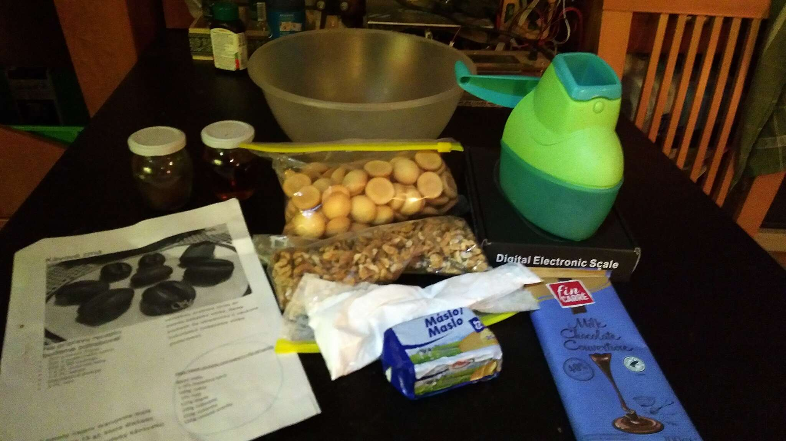

# Kávové zrnká #

## Suroviny ##

- Piškóty - 150g
- Vlašské orechy - 150g
- Čokoláda - 100g
- Cukor - 100g
- Maslo - 125g
- Rum - 1 Polievková lyžica (PL)
- Instantná káva - 1-2PL
- Voda - 80ml

[Odfotený recept so zoznamom surovín](./fotky/image20211219_010242943.jpg)

## Opis postupu ##
Vodu necháme zovrieť, pridáme kávu, cukor, rum, maslo a čokoládu a necháme stáť bokom. Zomelieme orechy a piškóty a pridáme čokoládovú zmes. Vypracujeme cesto, vytvarujeme zrnká a necháme vychladnúť. Nakoniec zrnká máčame v rozpustnej čokoláde.

[Odfotený recept s postupom](./fotky/image20211219_010318005.jpg)

## Názorný postup ##
1. Namelieme si orechy. 
2. Namelieme si piškóty. 
3. Navážime si cukor, maslo a čokoládu.   
4. Zovrieme vodu, pridáme kávu a navážený cukor, maslo a čokoládu. Necháme rozpustiť a dochutíme rumom.   
   Ak sa čokoláda, či maslo nechce rozpustiť môžeme im pomôcť v mikrovlnke. Pozor, už po chvíľke v mikrovlnnej rúre vie byť zmes riadne horúca.
5. Z namletých orechov a piškót a čokoládovej zmesi vymiesime cesto. 
6. Z cesta tvarujeme kávové zrnká. V našom prípade sme si pomohli formičkou. Aby sa zrnká ľahšie vyklápali z formičky, posýpame ju práškovým cukrom. 
7. Vychladené zrnká namáčame v roztopenej čokoláde a ukladáme na podložku, kde necháme čokoládu vytuhnúť. Najlepšie je šupnúť ich do chladu. 
8. Nakoniec očistíme vytuhnuté kávové zrnká od neželaných kvapiek čokolády a máme hotovo. 

## Výsledok ##

