# Košíčky s orechovou náplňou #
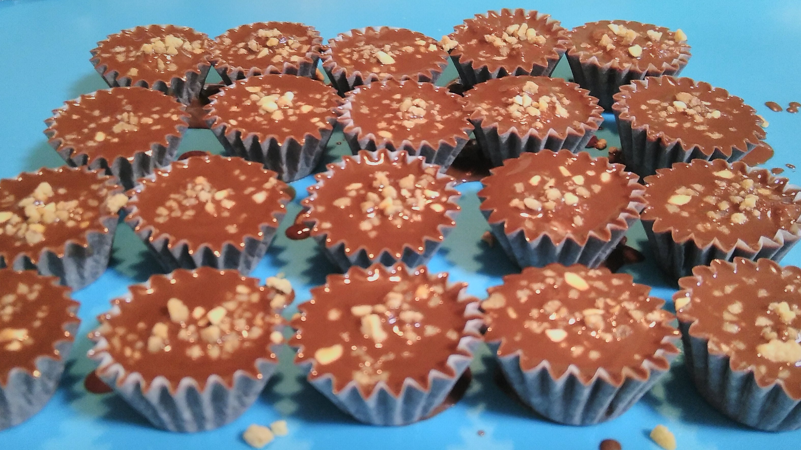

## Suroviny ##

### Čokoládová poleva ###
- Čokoláda na varenie – 200g
- Cera (alebo iný stužený tuk na polevy) – 100g
- Orechový/nugátový krém

### Orechový krém ###
- Kryštálový cukor – 100g
- Voda – cca 60 ml
- Čokoláda na varenie – 50g
- Maslo – 100g
- Mleté orechy – 100g
- Rum – 3PL (podľa chuti)

### Iné ###
- Košíčky z papiera (mini cukrárenské košíčky)
- Mandľový alebo orieškový krokan na posypanie

[Odfotený recept so zoznamom surovín a postupom](./fotky/recept.jpg)

## Opis postupu ##
Najskôr uvaríme cukrový sirup, do ktorého vmiešame čokoládu, maslo, rum a mleté orechy a necháme ju úplne vychladnúť. Studenú hmotu vyšľaháme na krém a použijeme ju ako plnku do čokoládových košíčkov. Košíčky najprv čiastočne naplníme čokoládovou polevou, pridáme orechový krém a nakoniec zalejeme zvyškom polevy a posypeme krokanom. Necháme stuhnúť v chlade.

## Názorný postup ##

Poznámka: Fotky v tomto návode sú z druhého, už podareného pokusu. Prvý skončil spáleným hrncom a rozleptanou paličkou – ak sa chceš poučiť na cudzej chybe, pozri si [nepodarený prvý pokus](./nepodarok.md).

1. Pripravíme si všetky suroviny – cukor, mleté orechy, maslo, čokoládu, rum, košíčky, krokan a digitálnu váhu. 

2. Odvážime potrebné množstvo mletých orechov. 

3. Odvážime čokoládu na náplň. 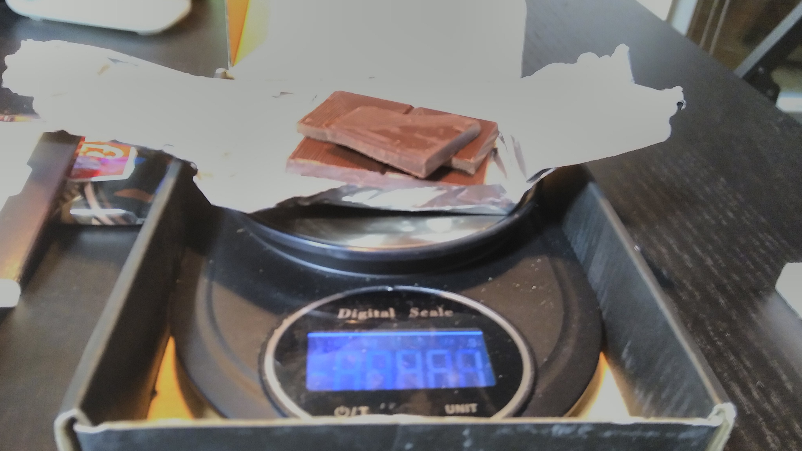

4. Odvážime cukor. Keďže nám po nepodarenom pokuse nezostal už žiaden kryštálový, použijeme práškový.

5. Odvážime maslo, ktoré pôjde do orechového krému. 

6. Pripravíme si hrniec, cukor a odmerané množstvo vody, z ktorých uvaríme cukrový sirup. 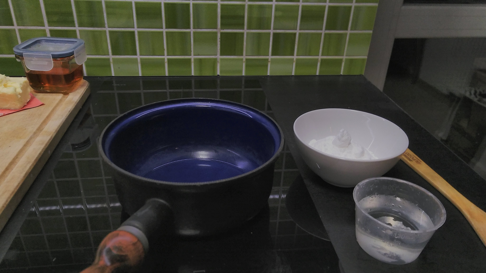

7. Cukor s vodou začneme zohrievať a miešame, kým sa úplne nerozpustí. 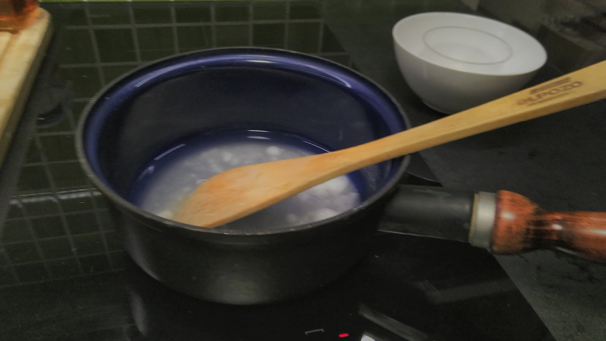

8. Cukrový roztok varíme na miernom "plameni", kým nezhustne na číru bublajúcu masu. Sledujeme konzistenciu – sirup má byť priezračný a hutnejší. 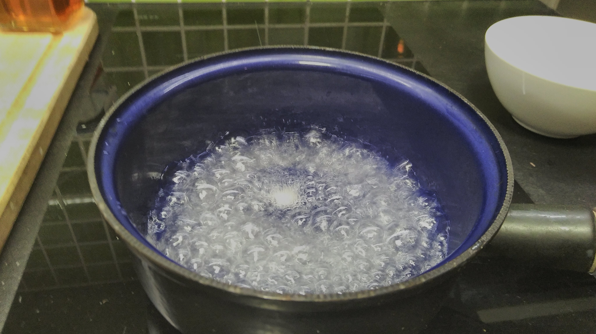 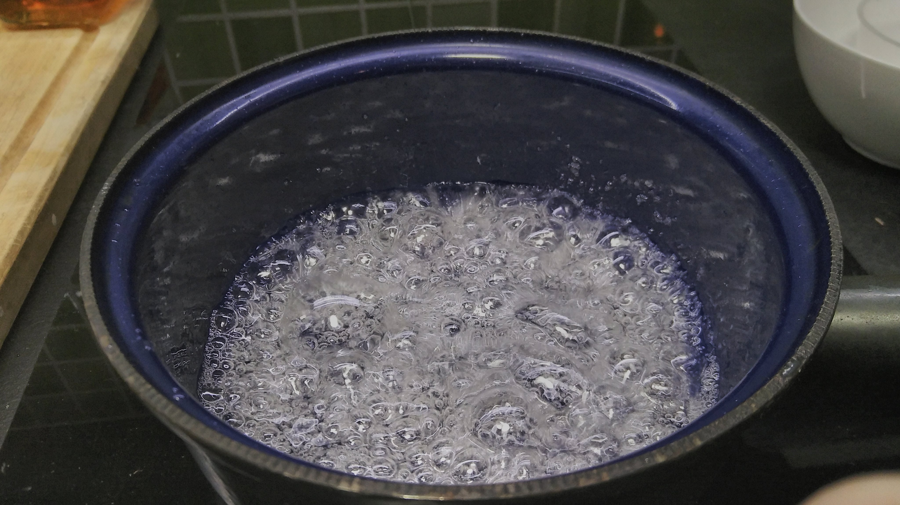

   - Namiesto teplomera sledujeme, kedy je sirup „tak akurát“. Kvapku prenesieme paličkou na studenú dosku a prstom skúšame, či je hmota lepkavá a či sa pri dotyku tvorí „pavučinka“. Ak sa tvorí, je hotovo. Pozor, pri prvom náznaku zmeny farby sirup okamžite odstavíme z ohňa.

9. Do horúceho sirupu pridáme maslo a čokoládu a miešame, kým sa všetko nerozpustí a nespojí. 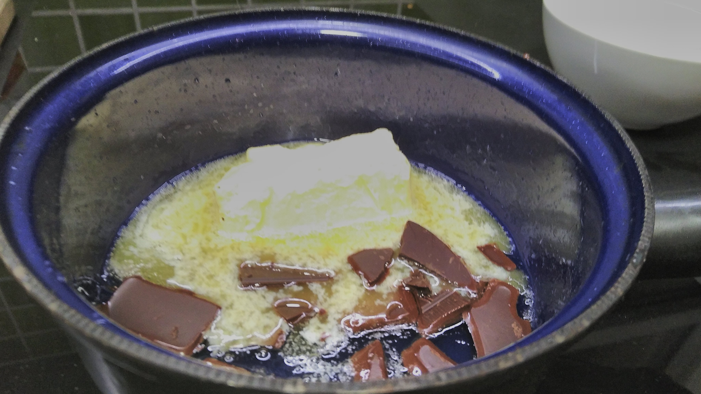

   - Aby vás to nemiatlo. V našom prípade používame indukčnú varnú dosku. V tomto prípade nie je nutné dávať hrniec z varnej dosky preč, stačí vypnúť ohrev.

10. Do čokoládovej zmesi primiešame mleté orechy a rum. Vznikne hustá orechová hmota.  

11. Hmotu necháme úplne vychladnúť a pripravíme si mixér a nádobu na šľahanie. 

12. Orechovú zmes preložíme do nádoby na šľahanie. 

13. Pomocou ručného mixéra hmotu vyšľaháme na krémovejšiu, nadýchanejšiu a svetlejšiu konzistenciu. 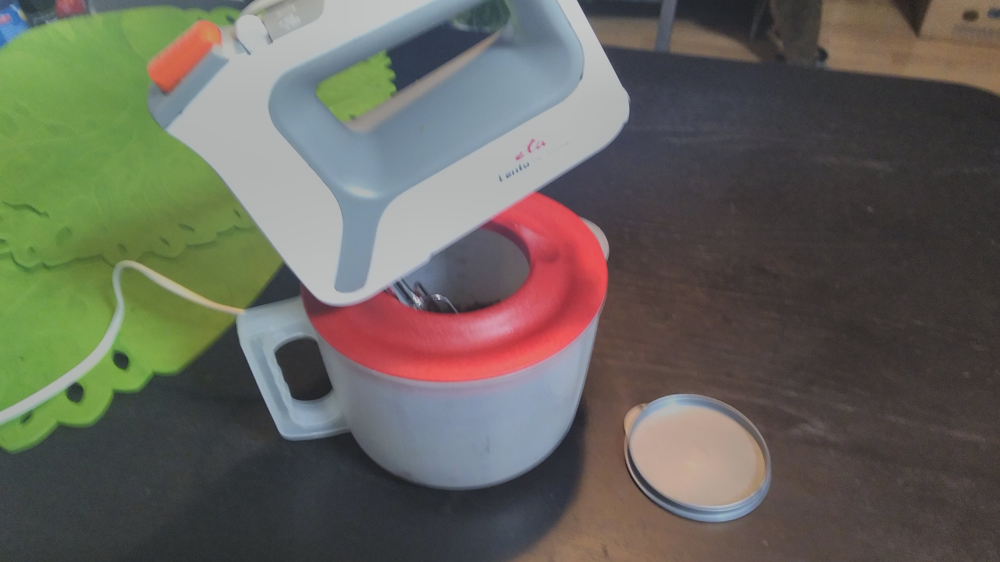 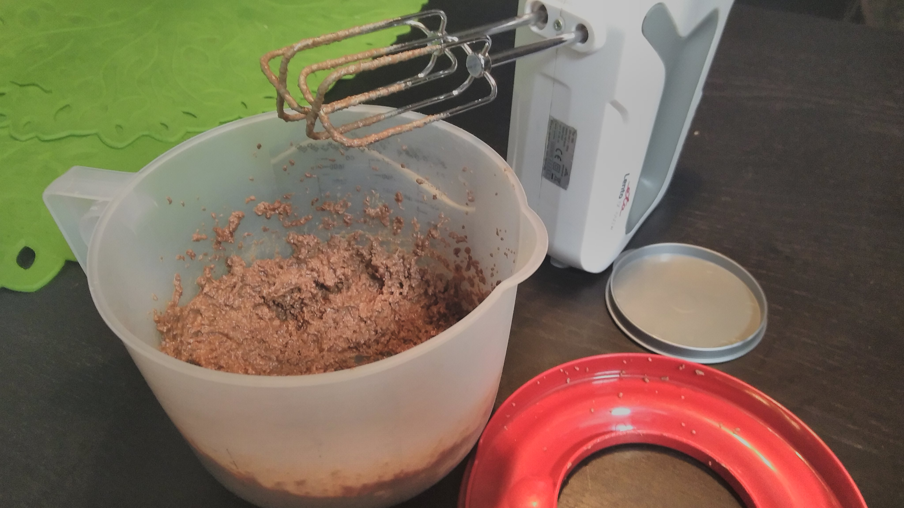

14. Pripravíme si suroviny na čokoládovú polevu – Ceru, čokoládu na varenie a hotový orechový krém. 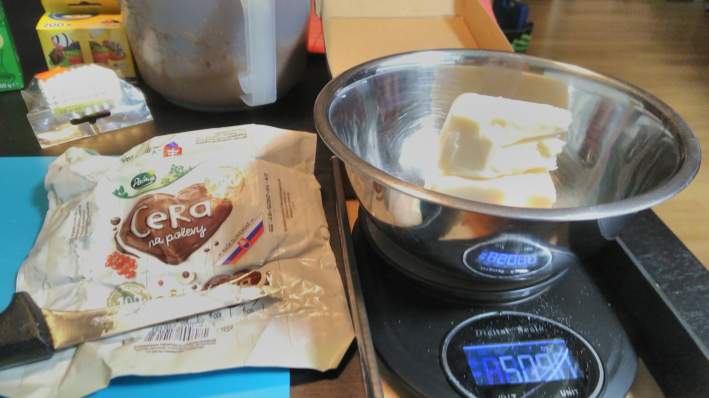 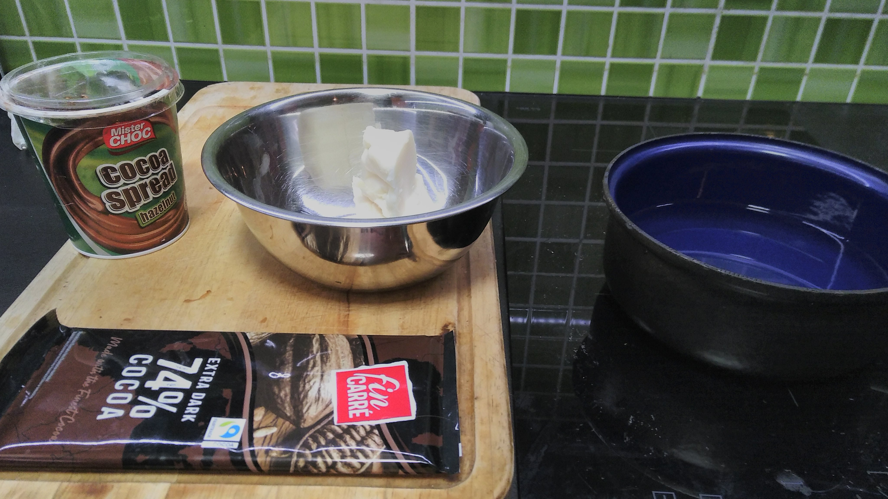

15. V miske vo vodnom kúpeli roztopíme tuk a čokoládu, prípadne pridáme trochu nugátovo-orieškového krému podľa chuti. Miešame, kým nám nevznikne hladká čokoládová poleva. 

16. Pred pridávaním orechového krému do košíčkov ho ešte raz krátko prešľaháme, aby bol pekne jemný. 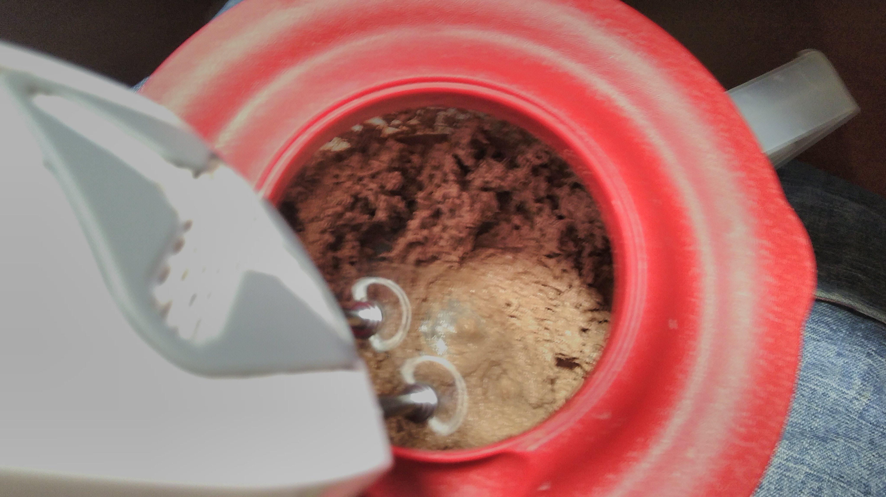

17. Pripravíme si košíčky, krokan, orechový krém a čokoládovú polevu. 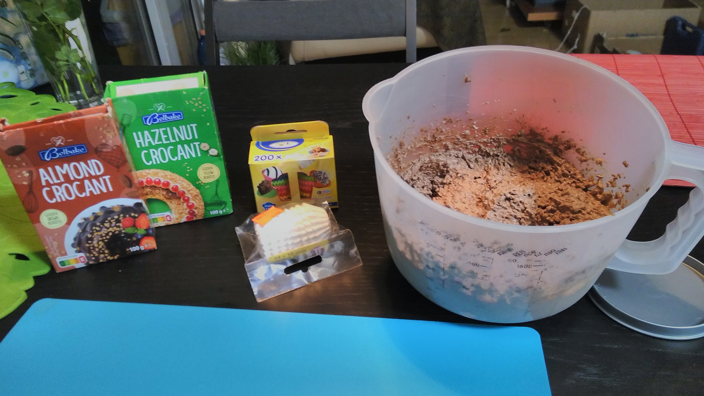

18. Košíčky rozložíme na podložku a pripravíme si misku s čokoládovou polevou. 

19. Do každého košíčka nalejeme tenkú vrstvu čokoládovej polevy na dno. Celkom rýchlo to ide aj obyčajnou lyžicou. 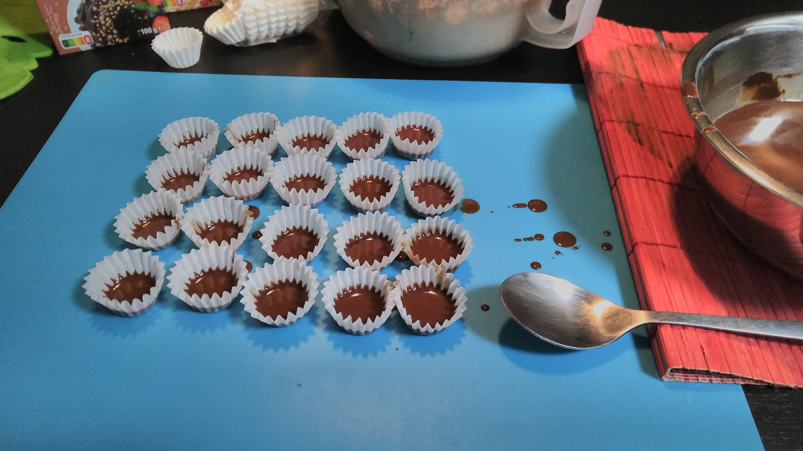

20. Na spodnú vrstvu čokolády nanesieme kopčeky orechového krému. 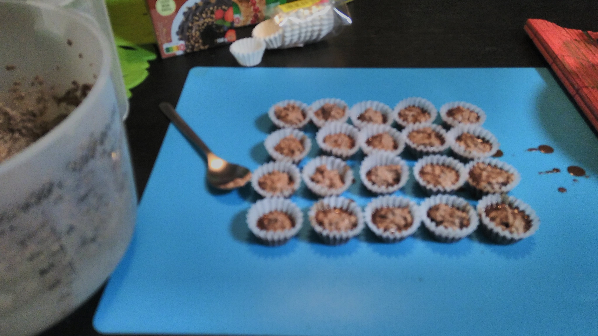 

21. Košíčky zalejeme vrchnou vrstvou čokoládovej polevy tak, aby vyplnila košíček po okraj. 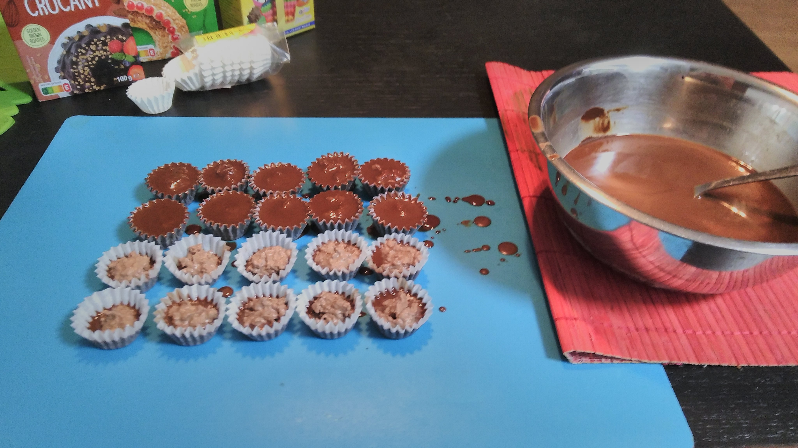 

22. Nakoniec povrch ešte teplej čokolády posypeme orechovým krokanom (mandľovým, lieskovoorieškovým alebo ich kombináciou). 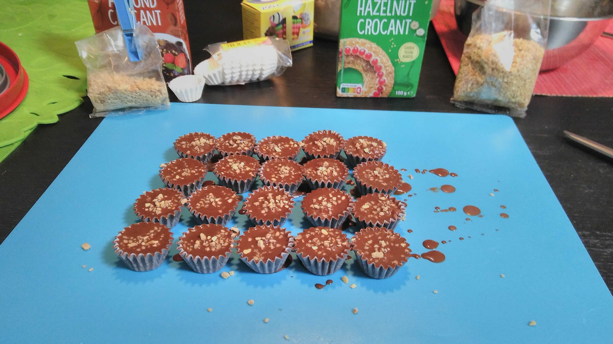 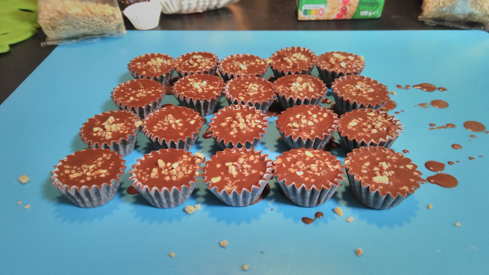 

## Výsledok ##

## Poznámky ##
- V pôvodnom recepte odporúčajú varenie na presnú teplotu (110°C) s použitím teplomera. V praxi sa to neosvedčilo – ľahko sa pripáli hrniec a sirup zhnedne.
- Oveľa lepšie je sledovať sirup očami: musí zostať priezračný. Ak začína meniť farbu, okamžite odstavíme z ohrevu (pri indukcii stačí vypnúť varnú zónu, hrniec netreba dávať preč).
- Hustosť sirupu kontrolujeme aj „pavučinkovým“ testom – kvapku dáme na studenú dosku a prstom skúšame, či sa pri dotyku tvorí lepkavé vlákno.
- Množstvo rumu môžeme upraviť podľa chuti alebo úplne vynechať.
- Košíčky skladujeme v chlade, najlepšie v uzatvárateľnej nádobe, aby čokoláda zostala lesklá a krehká.
