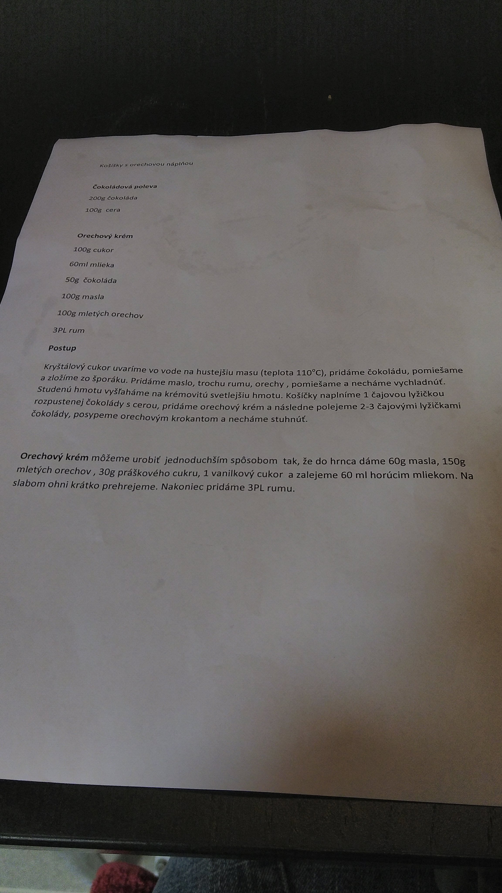
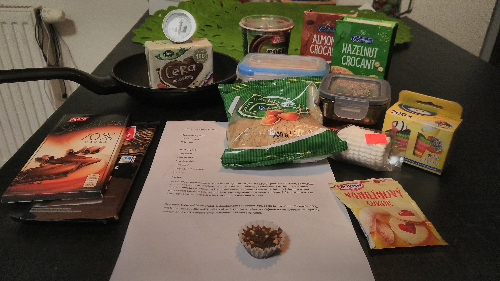
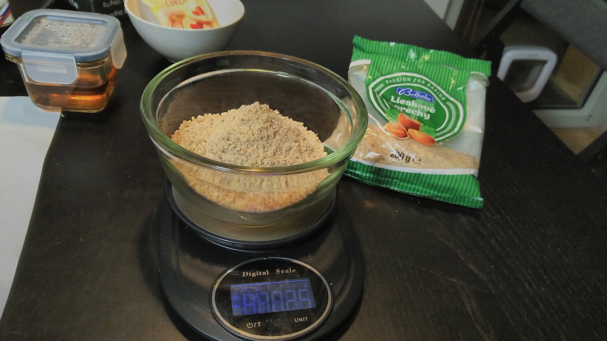
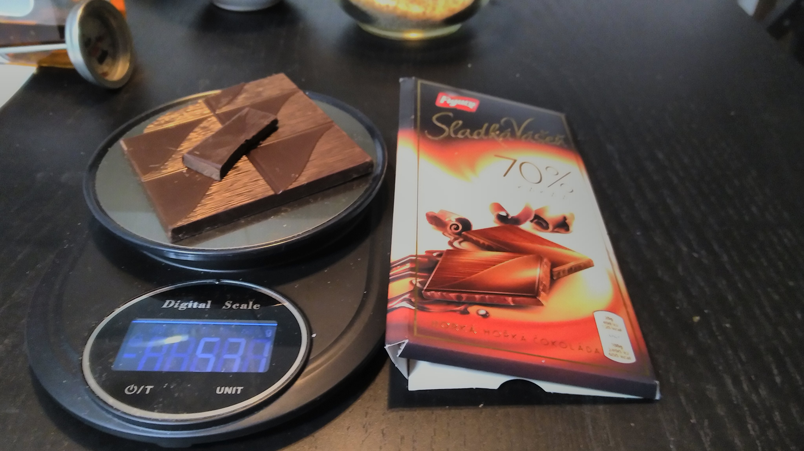
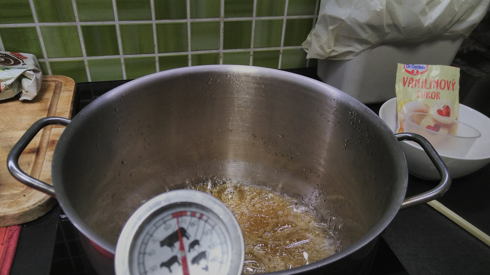
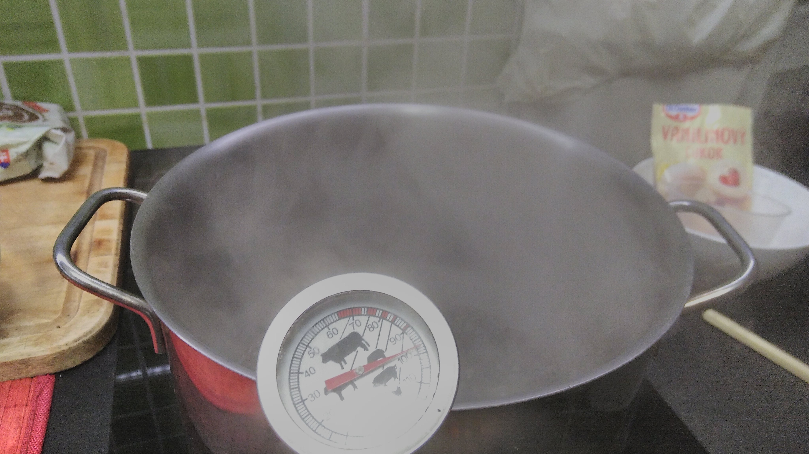
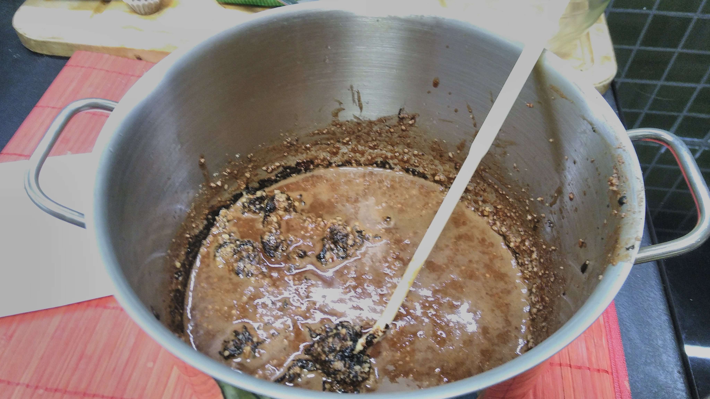
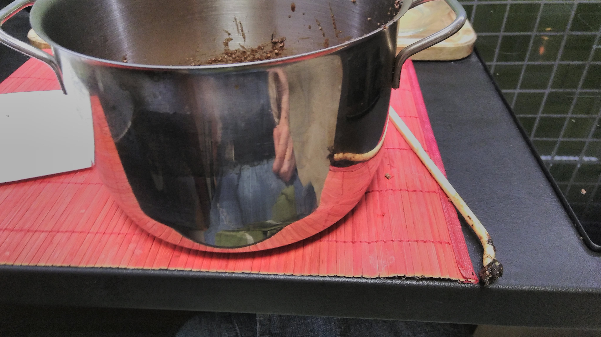

# Košíčky s orechovou náplňou – prvý (nepodarený) pokus #

Toto je dokumentácia prvého pokusu o košíčky, ktorý sa skončil spáleným hrncom, rozleptanou paličkou a poučením, že teplomer nie je všeliek. Ber to ako ilustrovaný návod „ako to nerobiť“.

## Príbeh nepodarku ##

1. Študujeme recept a plánujeme veľké veci. Nič ešte nenasvedčuje tomu, že skončíme pri drhnutí hrnca.  
   

2. Pripravíme si všetky suroviny, košíčky, krokan, teplomer aj ukážkový hotový košíček na motiváciu. Vyzerá to sľubne.  
   

3. Odvážime mleté orechy – základ dobrého orechového krému máme pod kontrolou.  
   

4. Odvážime čokoládu a maslo, ktoré mali skončiť v dokonalej orechovo-čokoládovej hmote.  
   
   

5. Do veľkého hrnca idú voda a cukor, vedľa čaká vanilínový cukor. Teplomer je pripravený, takže „čo by sa mohlo pokaziť?“.  
   

6. Cukor sa varí, teplomer sleduje situáciu, hrniec si spokojne bublá. My poctivo čakáme na odporúčaných 110°C.  
   

7. Sirup postupne tmavne, ale teplomer sa tvári, že je všetko v poriadku. Toto je moment, kedy sme sa mali prestať spoliehať na stupnicu a viac veriť vlastným očiam.  
   

8. Ešte trochu varenia, veľa pary a cukor sa mení na karamel, ktorý už nemá s receptom veľa spoločné. Až teraz sa začína teplomer približovať k odporúčanej teplote, ale už je neskoro (o čom ešte netuším).  
   

9. Po pridaní orechov a čokolády zisťujeme, že namiesto hladkého krému máme spálené hrudky prilepené na dne hrnca. Toto už žiadne šľahanie nezachráni.  
    

10. Finálny dôkaz nepodarku: hrniec s pripečenými zvyškami a palička, ktorej koniec sa v horúcom karamele čiastočne roztopil. Recept síce nevyšiel, ale získali sme cenné skúsenosti.  
    

## Čo sme si z toho odniesli ##
- Nenechávaj cukor na ohni, kým zmení farbu – pri prvom náznaku zmeny odstav hrniec, aj keď teplomer ešte neukazuje „správnu“ teplotu.
- Umelohmotné paličky nie sú ideálne na miešanie extrémne horúceho cukrového sirupu – radšej použi drevo alebo kov.
- Hrnce síce vyzerajú po takomto pokuse na vyhodenie, ale pri troche trpezlivosti sa dajú zachrániť. Tento konkrétny skončil v umývadle, nie v koši.

