# Krémové kocky s pistáciami a brusnicami #
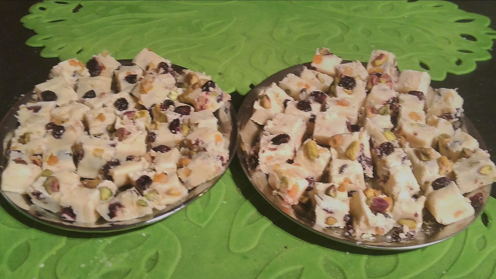

## Suroviny ##
- Biela čokoláda - 500g
- Osladené kondenzované mlieko (Salko)- 400g
- Sušené brusnice - ¾ hrnčeka
- Pistáciové oriešky (lúpané) - ½ hrnčeka
- Kandizovaná pomarančová kôra - 2 lyžičky
- Vanilková pasta - 1 lyžička

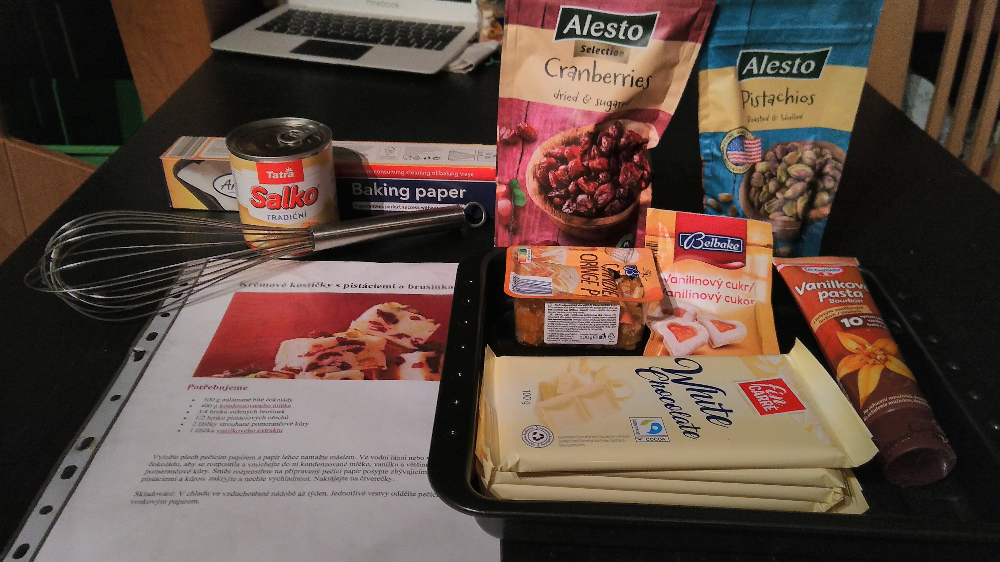

[Odfotený recept so zoznamom surovín a postupom](./fotky/recept.jpg)

## Opis postupu ##
Krémové kocky s pistáciami a brusnicami sa pripravujú roztopením bielej čokolády s kondenzovaným mliekom vo vodnom kúpeli, do ktorého sa pridajú brusnice, pistácie, vanilka a pomarančová kôra. Zmes sa rozotrie na plech, ozdobí a nechá stuhnúť v chladničke. Potom sa nakrája na kocky a podáva. Kocky by sa mali uchovávať vo vzduchotesnej nádobe.

## Názorný postup ##
1. Prípravíme si požadované množstvá surovín 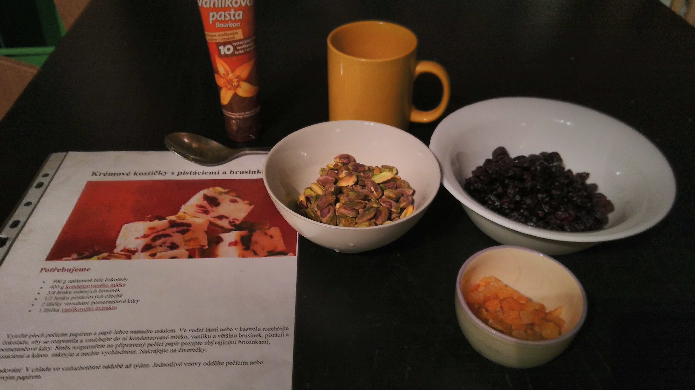

2. Vyložíme plech papierom na pečenie a upevníme ho štipcami, aby sa pri nalievaní zmesi neposúval 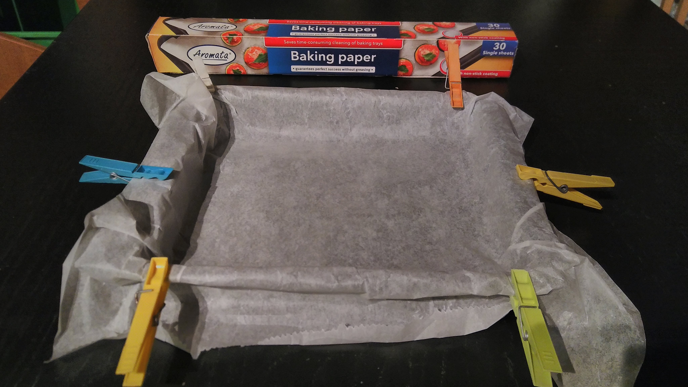

3. Do hrnca napustíme vodu a položíme na ňu menší kastról, aby sme mohli roztápať ingrediencie vo vodnom kúpeli. 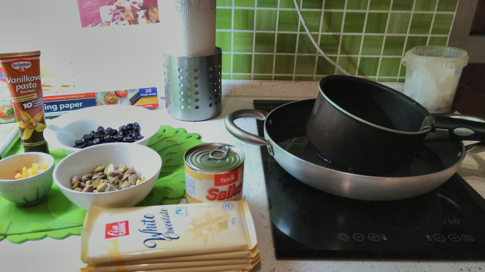

4. Do kastróla pridáme nalámanú bielu čokoládu. Za stáleho miešania necháme čokoládu pomaly roztopiť. 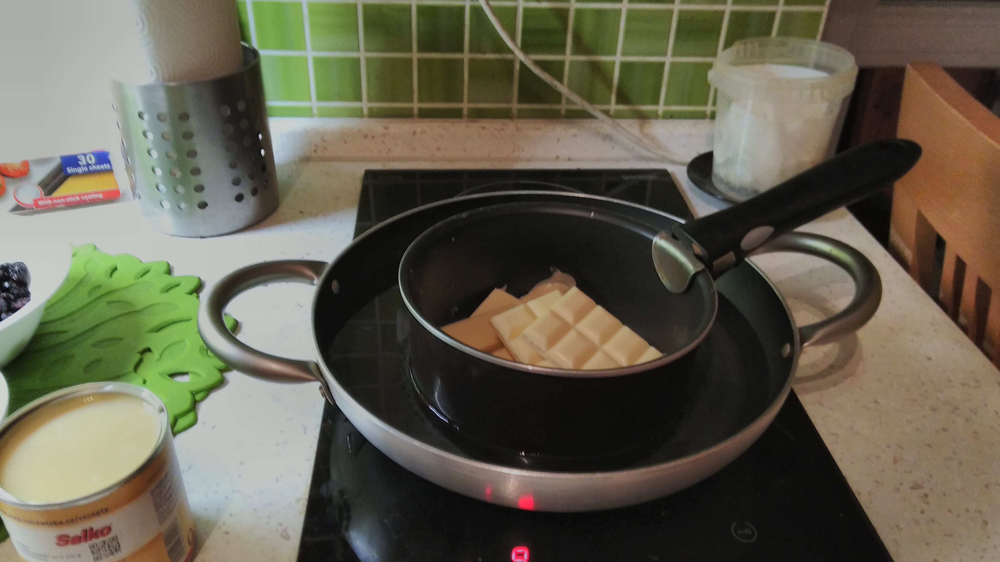 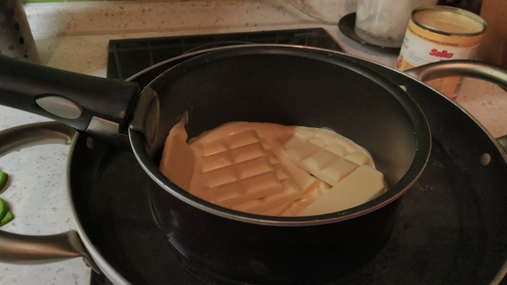 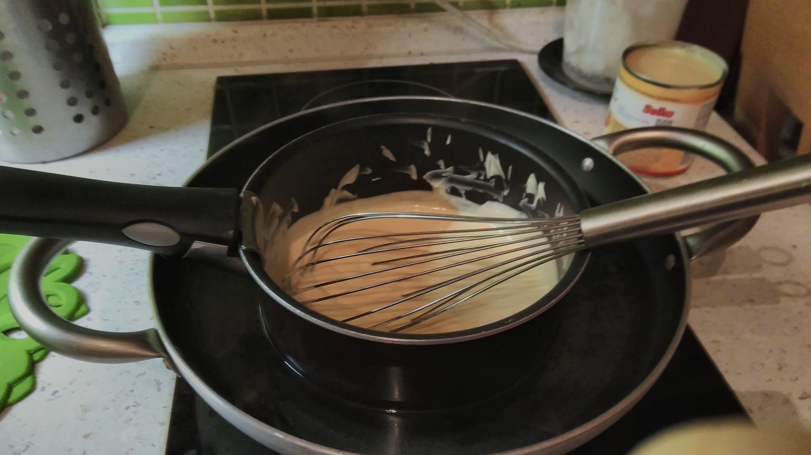

5. Do roztopenej čokolády zmesi pridáme kondenzované mlieko, vanilkovú pastu, sušené brusnice, pistácie a kandizovanú pomarančovú kôru. Dobre premiešame, aby boli všetky ingrediencie rovnomerne rozložené. 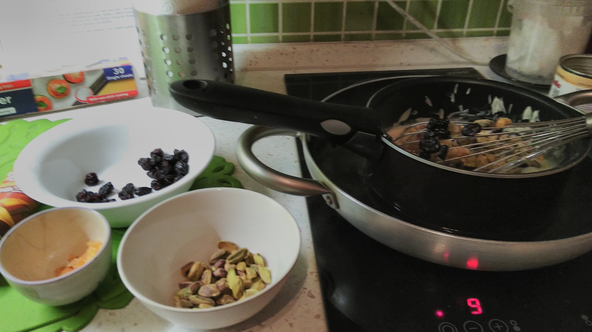 Metlička sa na miešanie neosvedčila, všetko sa v nej zachytávalo, najlepšie poslúžila čínska palička. 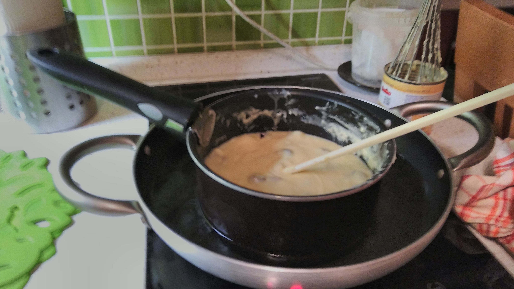

6. Zmes rovnomerne rozotrieme na pripravený plech a povrch posypeme zvyšnými brusnicami, pistáciami a kúskami pomarančovej kôry na dekoráciu. 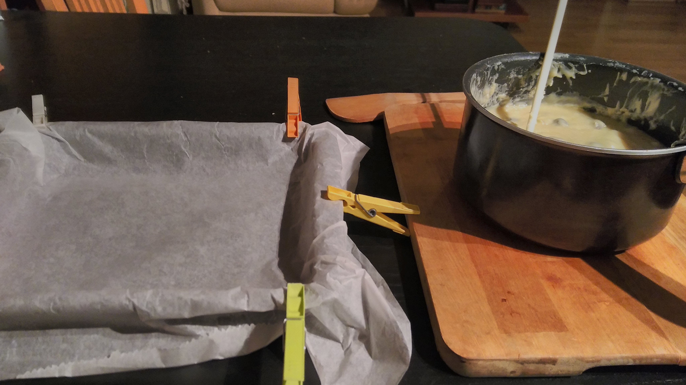 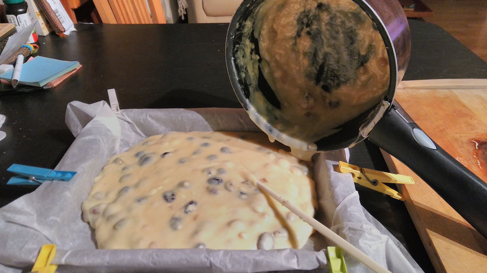 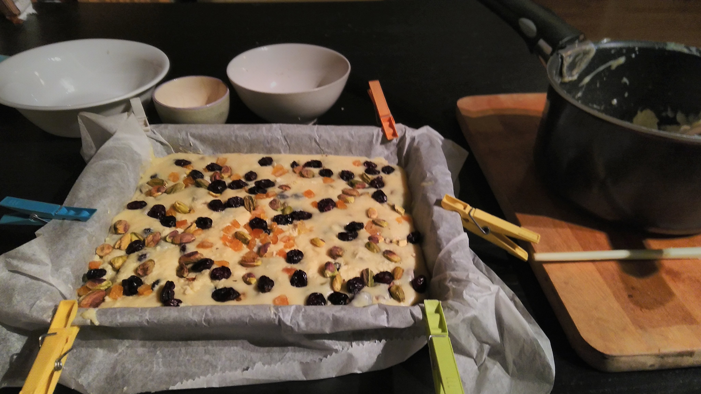

7. Plech vložíme do chladničky a necháme stuhnúť aspoň na 2 hodiny. Po vychladení nakrájame na malé kocky a poukladáme na podnos.
   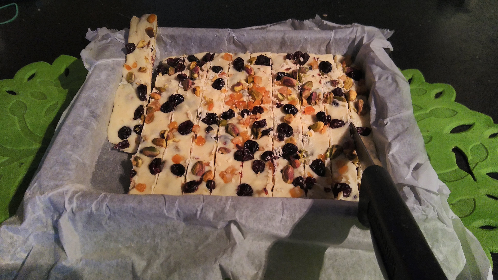

## Výsledok ##
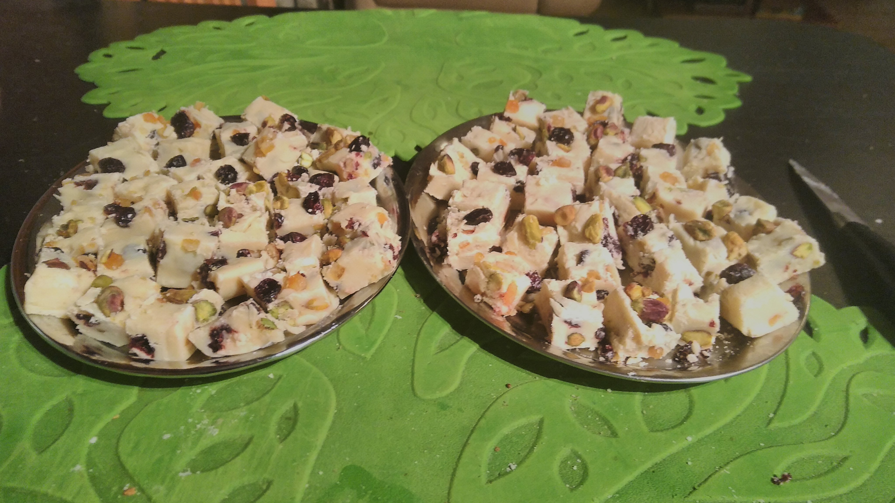

### Poznámky:
- Kocky skladujeme v uzavretej nádobe na chladnom mieste, aby si zachovali svoju štruktúru a chuť.
- Jednotlivé vrstvy môžeme oddeliť papierom na pečenie, aby sa kocky nezlepili.
