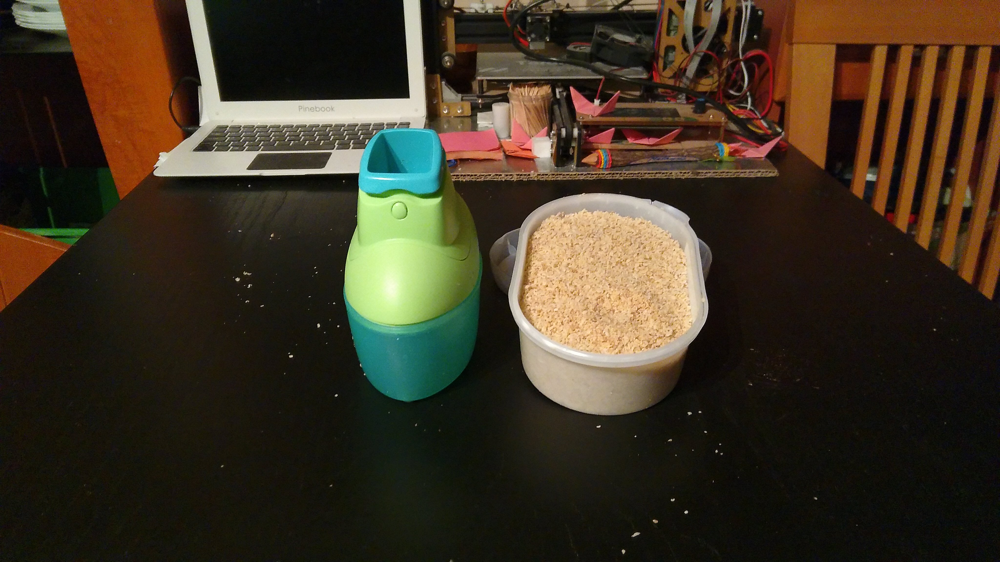
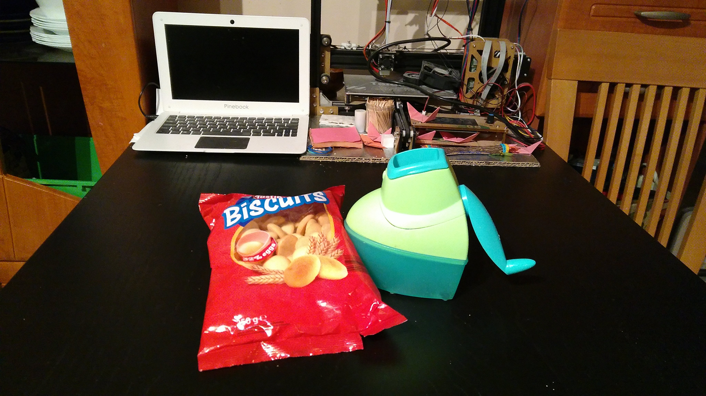
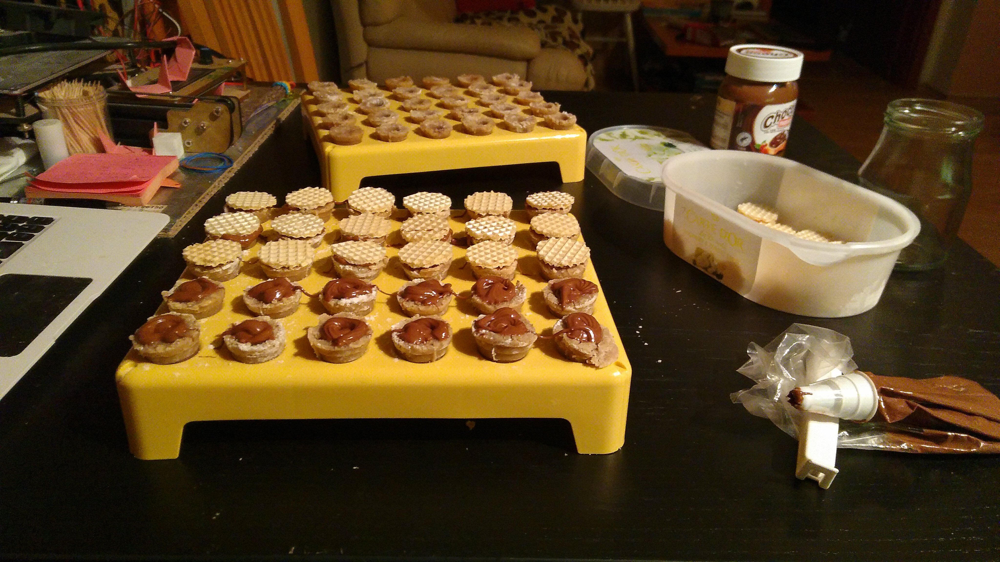
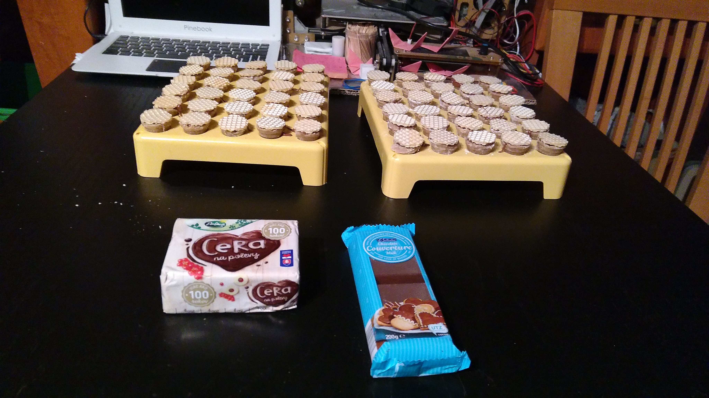

# Orechové úliky s čokoládou #

## Suroviny ##

- Vlašské orechy - 120g
- Piškóty - 120g
- Práškový cukor - 150g
- Vanilínový cukor - 1 balenie
- Kakaovo-orieškový krém
- Margarín - 125g
- Čokoláda na varenie
- Bielka - 2
- Rum - 4cl
- Citrónová šťava
- Tortové oblátky
- Formičky na úliky

[Odfotený recept so zoznamom surovín](./fotky/image20221213_012542104.jpg)

## Opis postupu ##
Orechy a piškóty pomelieme a spolu s cukrom, bielkami a rumom ich zmiešame a zmiešame. Z tejto hmoty potom pomocou formičky tvarujeme úliky, napĺňame ich kakaovo-orieškovým krémom a zatvárame vykrojenou oblátkou. Čokoládu na varenie a tuk rozpustíme a úliky v nich ponamáčame.

[Odfotený recept s postupom](./fotky/image20211219_010318005.jpg)

## Názorný postup ##
1. Namelieme si orechy.  
2. Namelieme si piškóty.  
3. Z pomletých orechov, piškót, práškového a vanilínového cukru, bielkov, rumu a citrónovej šťavy vymiešame lepkavú hmotu, ktorú necháme odležať na chladnom mieste.  Poznámka: Rum je len na ochutenie, môže sa vynechať, bielka majú za úlohu zvlhčiť zmes aby držala a nerozpadala sa. Citrónová šťava mierne dochutí zmes a tiež má za úlohu ju zvlhčiť. Pomer môžete meniť podľa vlastnej chuti, množstvo tak, aby hmota bola akurátna na tvarovanie (ani riedka, ani suchá). 
4. Z vychladenej zmesi tvarujeme pomocou formičiek úliky (dutý kužeľ bez dna), ktoré odkladáme na umelohmotný podstavec hore dnom, aby sa nám neskôr ľahšie plnili. Aby sa hmota nelepila k formičke, posýpame hmotu, alebo formičku práškovým cukrom.  Poznámka: Na obrázku vidíte 2 formičky čo som používal (čo mi mama dala), jedna je otváracia forma do ktorej sa vtláča hmota a druhou sa vytvára dutina v úliku na náplň. Dakedy dávnejšie sme nemali takéto špeciálne formičky. Mamina použila hračkárske dopravné kužele z autostrády a dutinku robila prstom. 
5. Z tortových oblátok povykrajujeme kolieska, ktoré neskôr použijeme na uzavretie úlika s náplňou.  
6. Kakaovo-orieškový krém, ktorým chceme naplniť úliky, si dáme do cukrárskeho vrecka.  Aby sa nám s krémom ľahšie manipulovalo, je dobré ho trochu zohriať (napr. v mikrovlnnej rúre) aby bol viac tekutý.  
7. Zostáva už len úliky ponamáčať v čokoláde. Na to budeme potrebovať tuk a čokoládu na varenie, ktoré rozpustíme vo vodnom kúpeli.  Odoženieme zvedavého kocúra, že to nie je nič pre neho.  Do hrnca na sporáku napustíme vodu, do ktorej vložíme misku či inú nádobu, v ktorej budeme rozpúšťať tuk a čokoládu v pomere 1:2. 
8. Keď je zmes tuku a čokolády roztopená, namáčame v nej úliky a ukladáme na papier či podnos, aby čokoláda stuhla.  
9. Nakoniec vychladnuté úliky očistíme od prebytočnej čokolády a poukladáme na podnos. 

## Výsledok ##
 
