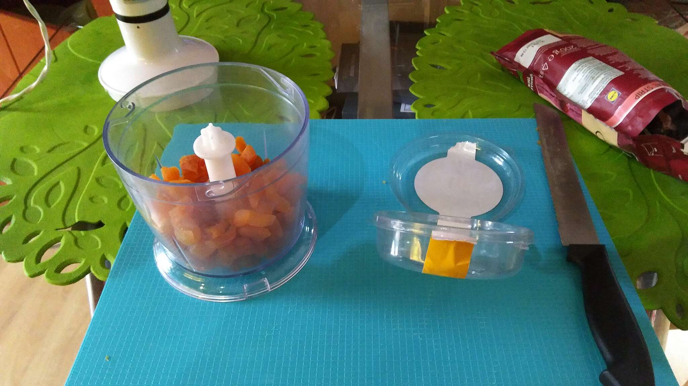
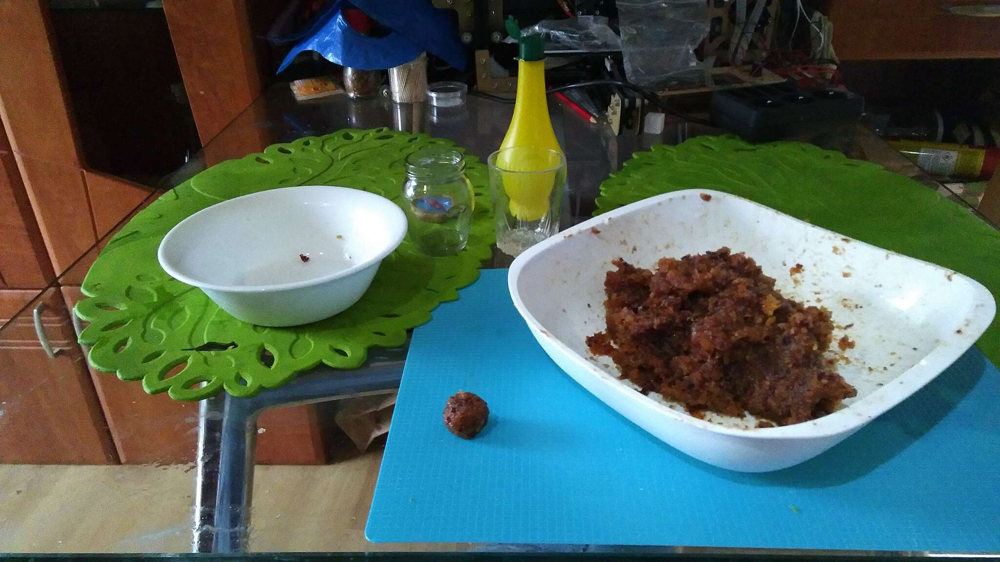
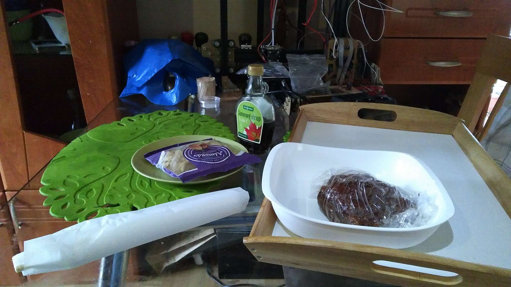

# Ovocné guľky s mandľovými lupienkami #

## Suroviny ##
- Sušene marhule - 250g (sušené marhule z obchodu je dobré omyť vo vode, lebo sa používa konzervačná látka SO2 - Oxid siričitý)
- Zmes sušeného/kandizovaného ovocia (mango, ananás, hrušky, brusnice, …) - 250g
- Marcipán - 100g (ak nie je marcipán, môže byť aj lekvár)
- Mandľové lupienky - 1 balenie
- Šťava z citrónu - 0,5dcl
- Pomarančový likér - 0,3dcl (môže byť aj rum, alebo nemusí byť vôbec)
- Javorový sirup (používa sa na to, aby hmota viac lepila, netreba ho, postačí aj lekvár)

## Opis postupu ##

Ovocie pokrájame, pomelieme, rozmixujeme, všetky ingrediencie spojíme. Musíme dostať lepkavú hmotu, z ktorej tvarujeme guľky, ktoré obaľujeme mandľovými lupienkami.

## Názorný postup ##

1. Pokrájame a rozmixujeme ovocie. 

   - Rozmixujeme marhule.  

   - Nakrájame a rozmixujeme ovocie.   Ak by mixovanie išlo ťažko, pomôže zvlhčenie likérom, či sirupom, či citrónovou šťavou.

    

2. Zmiešaním rozmixovaného ovocia, marcipánu, citrónovej šťavy a likéru vyrobíme lepkavú hmotu. Výslednú hmotu dobre vymiesime, aby sa z nej dali robiť guľôčky.  

3. Z hmoty vyrábame guľôčky a obaľujeme ich v mandľových lupienkoch. Ak je hmota málo lepivá, pokvapkáme ju javorovým sirupom. Hmotu sme nechali cez noc v chladničke uležať, guľôčky ukladáme na papier na pečenie. Piecť nebudeme, len aby sa nelepili. 

## Výsledok ##

